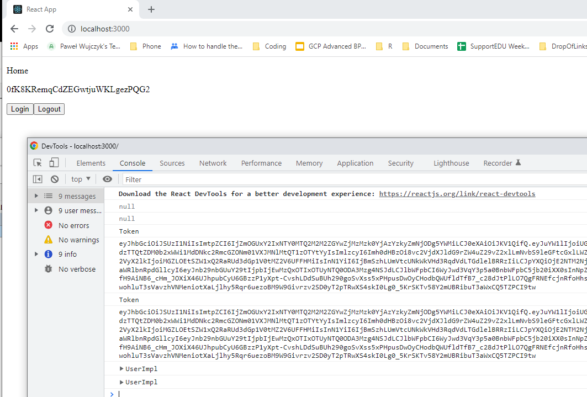

<!--Category:React,Firebase--> 
 <p align="right">
    <a href="http://productivitytools.tech/autentication-and-refresh-token-in-react-app/"><a> 
    <a href="https://github.com/ProductivityTools-Learning/ProductivityTools.Example.FirebaseAuthenticationKept"></a>
</p>
<p align="center">
    <a href="http://http://productivitytools.tech/">
        
    </a>
</p>

# Autentication and refresh token in react app

Example shows how to create application which will use Google as an autenticator service and firebase as an integration layer. Webpage also take care about refreshing tokens so user won't be logout.

<!--more-->

Tokens returned from Google/Firebase are valid for 1hour, so the main responsibility of the Contxt is to refresh it. In this implmenentation code refreshes token every 10 minutes.

```javascript 
import { createContext, useEffect, useContext,useState } from 'react';
import {auth} from './firebase.js'

 const AuthContext = createContext({
     user: null
 })

export function AuthProvider({children}) {
    const [user, setUser] = useState(null);
    useEffect(() => {
        return auth.onIdTokenChanged(async (user) => {
             if (!user) {
                 console.log("Missing user");
                 setUser(null);                 
             }
             else {
                 const token = await user.getIdToken();
                 setUser(user);
                 console.log("Token")
                 console.log(token);
             }
         })
    }, []);

    useEffect(() => {
        const handle = setInterval(async () => {
            const user = auth.currentUser;
            if (user) await user.getIdToken(true);
            console.log("refresh token")
        }, 10* 60 * 1000);
        return () => clearInterval(handle);
    }, []);

    return (
        <AuthContext.Provider value={{ user }}>{children}</AuthContext.Provider>
    )
}
export const useAuth = () => {
    return useContext(AuthContext);
  };
```

Aplication has simple interface it allows to login/logout user. It displays user Id. 
I encourage to change the refresh value and check how request for the token is performed.

<!--og-image-->

